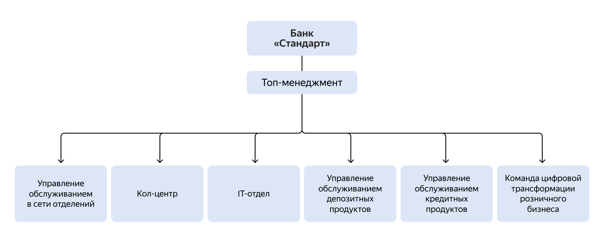

# Проектная работа 9 спринта: Работа с требованиями и стейкхолдерами

## О компании

«Стандарт» — это небольшой банк. У него есть сайт и интернет-банк, но клиенты редко ими пользуются. Сайт умеет только
показывать маркетинговую информацию, а функционал интернет-банка ограничивается проведением платежей и открытием текущих
счетов (дебетовых карт).

Основная категория клиентов банка — люди старшего возраста, которые предпочитают офлайн-обслуживание. Именно поэтому
онлайн-каналы «Стандарта» развиты так слабо.

Сотрудники в отделениях сейчас работают напрямую с автоматизированной банковской системой (АБС). Это основная система,
где производится учёт операций по счетам и бухгалтерия. Чтобы реализовать возможность проведения платежей и открытия
текущих счетов, интернет-банк интегрировали с АБС — напрямую с её базой данных.

Сотрудники кол-центра принимают звонки через отдельную систему. Ещё при необходимости компания может подключать
партнёрский кол-центр. Он работает по готовым скриптам звонков, которые ему передают бизнес-представители банка.

## Структура компании

Важно понимать, что в банковской системе различают фронт-офис и бэк-офис. Это подразделения, которые работают над
разными задачами компании. Менеджеры фронт-офисной системы работают с посетителями. Они несут ответственность за
контактирование с людьми, маркетинг и продажи. Менеджеры бэк-офиса отвечают за деятельность компании на финансовых
рынках и управление активами и пассивами банка. Они поддерживают внутренние бизнес-процессы, которые не видны клиентам.

#### В структуре компании «Стандарт» семь основных направлений:

- **Управление обслуживанием в сети отделений.** Сюда входят менеджеры фронт-офиса — сотрудники, которые работают в
  отделениях
  банка. У «Стандарта» 50 отделений в разных регионах. Там работают 500 человек.
- **Управление IT.** Над интернет-банком работают две команды: внутри банка этим занимается 10 человек и ещё 10 человек
  работает на стороне подрядчика. Ещё внутри направления есть команда, которая занимается непосредственно АБС —
  автоматизированной банковской системой. Этот отдел состоит из 20 человек.
- **Управление обслуживанием депозитных продуктов.** Сюда относятся менеджеры бэк-офиса, которые специализируются на
  депозитах. Всего их 50 человек.
- **Управление обслуживанием кредитных продуктов.** Сюда относятся менеджеры бэк-офиса, которые специализируются на
  кредитах.
  Их тоже 50 человек.
- **Кол-центр банка «Стандарт».** В банке работают 200 операторов. Также важно учитывать, что в качестве системы
  кол-центра
  банк использует не собственное решение, а платформу подрядчика. На стороне подрядчика выделена команда сопровождения,
  которая поддерживает и дорабатывает систему. В ней работают пять человек.
- **Партнёрский кол-центр.** Команда партнёрского кол-центра насчитывает 100 человек.
- **Команда цифровой трансформации розничного бизнеса.** В ней 10 человек.

## IT-ландшафт компании

Теперь обратимся к IT-системам компании. Дела обстоят так:

- **Интернет-банк.** Клиент-серверная система на веб-фреймворке ASP.NET MVC 4.5 на основе .NET Framework 4.5 и СУБД MS
  SQL.
  Монолит реализован на платформе подрядчика. Команда банка может самостоятельно вносить изменения, но обновление ядра
  системы привязано к подрядчику. Интернет-банк работает на одной группе серверов в ЦОД. Также есть резервный ЦОД, на
  который можно переключиться в случае сбоя.
- **Автоматизированная банковская система (АБС).** Интерфейс пользователей — это десктопный клиент на Delphi и СУБД на
  Oracle.
  Основная логика работы системы реализована процедурами на PL-SQL в СУБД. Система полностью разрабатывается внутри
  банка.
- **Система кол-центра.** Это клиент-серверная система на платформе подрядчика, работает на технологиях подрядчика. Сама
  платформа предназначена для автоматизации CRM-решений, но банк использует только функционал кол-центра. У системы
  веб-интерфейс на React.js, бэкенд на Java Spring Boot и базы PostgreSQL. Архитектура микросервисная.
  Система развёрнута в инфраструктуре банка и полностью поддерживается подрядчиком. В команде АБС есть несколько
  специалистов с опытом в Java-стеке. Они могут периодически вносить изменения в систему самостоятельно по просьбе
  бизнеса, поскольку она имеет возможности для расширения.
- **Система партнёрского кол-центра.** Это внешняя система. Партнёрский кол-центр и подрядчик, чью систему использует
  кол-центра банка, — разные компании.
- **СМС-шлюз телеком-оператора.** Его поддерживает IT-отдел банка, взаимодействуя с телеком-оператором.
  Телеком-оператор — внешний оператор по отправке СМС.
- **Сайт** — собственная разработка банка на PHP и React.js.

## Проблемы бизнеса

Чтобы развиваться дальше, компании нужно привлечь больше клиентов, которые относятся к более молодым категориям. Поэтому
сейчас в приоритете развитие онлайн-каналов для привлечения и обслуживания клиентов. Бизнес нуждается в цифровой
трансформации.

## Планы развития бизнеса

Компания планирует развивать сайт и интернет-банк, чтобы предоставлять больше продуктов онлайн. Здесь две ключевые
задачи.

### 1. Интернет-банк — открытие депозитов и накопительных счетов

«Стандарт» может выдавать кредиты и депозиты по ставкам, которые намного выгоднее, чем у большинства конкурентов.
Поэтому руководство решило сделать упор на эти продукты в первую очередь.

Сейчас клиент может открыть депозитные и накопительные счета только в отделении банка. При этом задействованы и
фронт-офис, и бэк-офис.

Цель на год — сделать так, чтобы клиент мог полностью автоматически открыть депозит или накопительный счёт в
интернет-банке, а при обращении в отделение депозит открывался без участия сотрудников бэк-офиса. Но для этого
сначала нужно реализовать MVP, где можно оформить заявку на депозит онлайн. Обрабатывать заявки продолжат сотрудники
бэк-офиса.

### 2. Сайт — подача заявки на депозит

В ближайшей перспективе компания хочет, чтобы на сайте можно было подать заявку на депозит. Когда потенциальный
клиент отправит заявку, с ним свяжется менеджер из кол-центра и расскажет об условиях по депозиту.

На следующем этапе банк планирует, что подать заявку на кредит можно будет и в интернет-банке, и на сайте.
Кредитование — это значительно более важный процесс для банка, но его также гораздо сложнее реализовать онлайн.
Поэтому сначала было решено сосредоточиться на процессе открытия депозитов.

## Цели бизнеса

Итак, зафиксируем, какие цели определил бизнес:
- **Промежуточное состояние (через 6 месяцев).** Клиент может открыть депозит или накопительный счёт в интернет-банке. В
MVP бэк-офис может обрабатывать заявки по старому процессу.
- **Финальное состояние (через год).** Клиент открывает депозит или накопительный счёт в интернет-банке. При этом бэк-офис
не участвует в процессе — всё происходит автоматически без участия сотрудников банка. При обращении клиента в
отделение банка задействованы только сотрудники фронт-офиса. Это позволит сократить операционные издержки на открытие
новых депозитов.