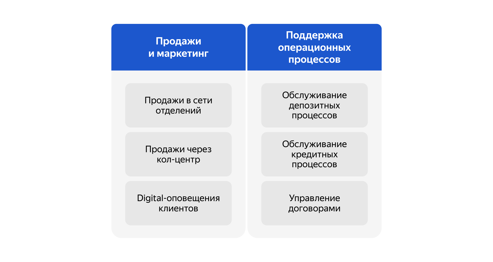
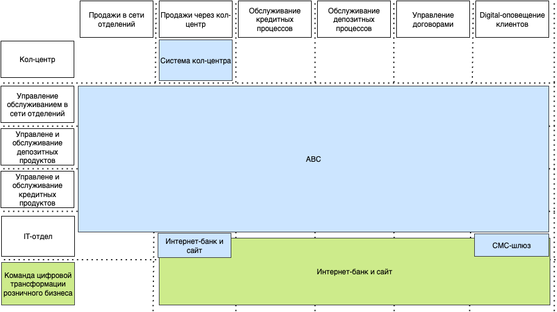
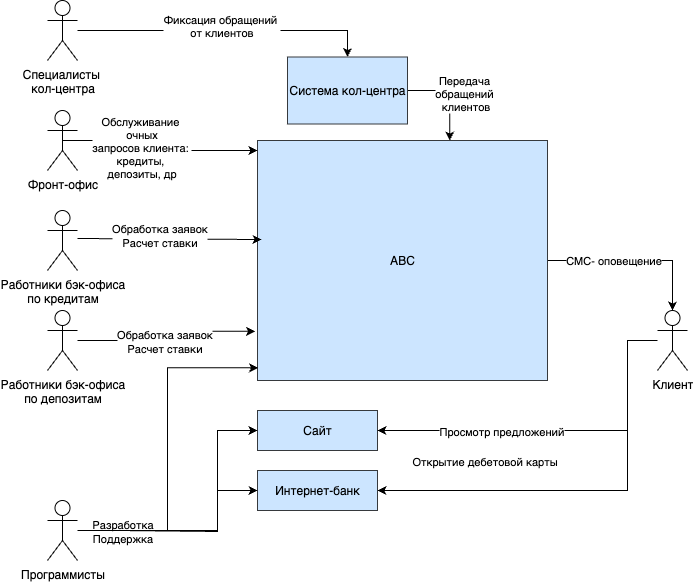

# Задание 1. Карта IT-ландшафта и схема интеграции приложений

## Карта бизнес-возможностей (Business Capability Map)

# Решение

https://drive.google.com/file/d/1f0ucVh8gKeGgxS-Gc-xDi9QRwJW-CwtG/view?usp=sharing

## 1. Карта текущего IT-ландшафта

На приведенной ниже схеме синим цветом обозначено текущее состояние системы, а зеленым - будущее состояние после
трансформации.
Также предполагается, что:

- СМС-шлюз разрабатывает программисты для оповещения ABC-системой клиента
- Интернет банк и сайт в текущей системе помогают только продавать через колл-центр (клиент переходит на сайт или
  интернет-банк и видит интересную рекламу / предложение по инструменту банка и звонит в колл-центр после)
- Система кол-центра предназначена для продаж через кол-центр и фиксации заявок от кол-центра
- Главное звено системы - ABC - c ней взаимодействую все отделы, кроме кол-центра
- Интернет банк в будущем после цифровой трансформации предполагает обработки всех текущих бизнес-возможностей кроме
  очных продаж в офисе

  

## 2. Схема интеграции приложений с указанием участников процессов

