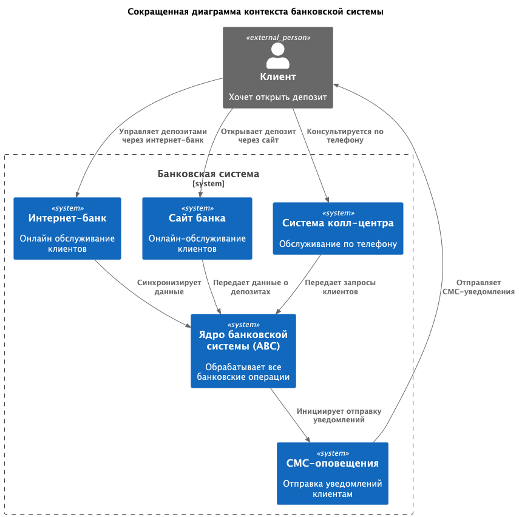
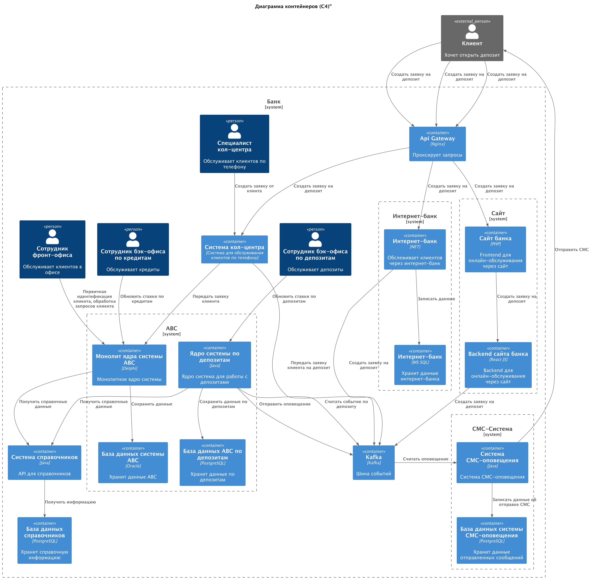

# Задание 3. Открытие депозитов онлайн

# Решение

### **Название задачи:**

MVP для банка: открытие депозитов онлайн посредством сайта и интернет банка. Адаптирование к нагрузке

### **Автор:**

Николаева Елизавета

### **Дата:**

27.07.2025

### **Функциональные требования**

| **№** | **Действующие лица или системы**       | **Use Case**                                                                                                    | **Описание**                                                                                                                                                                      |
|:-----:|:---------------------------------------|:----------------------------------------------------------------------------------------------------------------|:----------------------------------------------------------------------------------------------------------------------------------------------------------------------------------|
|   1   | Интернет-банк, ABC-система депозитов   | Пользователь может создать депозит через интернет-банк                                                          | Интернет-банк нужно расширить возможностью создания депозитов.                                                                                                                    |
|   2   | Сайт, АBC-система депозитов            | Пользователь может создать депозит через сайт                                                                   | На сайте нужно добавить возможность открытия депозита клиентом                                                                                                                    |
|   3   | АБС-система депозитов, СМС-система     | После открытия депозита клиенту отправляется СМС-оповещение                                                     | Необходимо наладить отправку СМС-уведомлений клиенту                                                                                                                              |
|   4   | Бэк-офис, АBC-система депозитов        | Для сотрудников бэк-офиса должна быть создана единая удобная система для задания ставок по депозитам и кредитам | Необходимо написать такую систему депозитов, с которой смогут взаимодействовать сотрудники бэк-офиса, и которая также смодет производить все операции по депозитам в едином месте |
|   5   | Система справочных данных, ABC-система | В банке должна быть единая система справочных данных                                                            | Справочные данные должны лежать в едином месте, чтобы все, кто ими пользуется, обладал одинаковой информацией                                                                     |
|   6   | СМС-уведомления, Клиент                | Клиент должен получать СМС-уведомления от собственной системы банка по отправке СМС                             | Банку важно, чтобы система СМС-уведомлений была разработана его разработчиками, чтобы уйти от подрядчика                                                                          |

### **Нефункциональные требования**

| **№** | **Требование**                                                                                            |
|:-----:|:----------------------------------------------------------------------------------------------------------|
|   1   | Все БД должны иметь мастера на запись и два слейва на чтение                                              |
|   2   | Интернет-банк и сайт в рамках ЦОД должны иметь по несколько инстансов с балансировщиком нагрузки          |
|   3   | Отклик по всем операциям клиента должен быть рассчитываться миллисекундами                                |
|   4   | Все сервисы должны работать 24/7 и быть доступны в 99,9% случае                                           |                                                                                                      |
|   5   | Чувствительная информация с сайта и интернет-банка должна быть зашифрована надежным алгоритмом шифрования |                                                                                                      ||
|   6   | Необходимо снизить нагрузку с БД Oracle                                                                   |
|   7   | Необходимо написать собственное решение для СМС-оповещения                                                |
|   8   | Необходимо снизить нагрузку с монолита ABC по части депозитов                                             |
|   9   | Необходимо использовать известный команде стек технологий                                                 |

### **Решение**

Диаграмма контекста С4

Диаграмма контейнеров C4

Ключевые решения:

- Использование Kafka для создания депозитов позволяет снизить нагрузку на монолит ABC, частично распилить его по части
  депозитов. Кроме того, это решение отлично масштабируется горизонтально, в будущем можно добавить несколько инстансов
  сервиса депозитов и обрабатывать сообщения Kafka параллельно
- Отдельный микросервис для депозитов позволяет снизить нагрузку с монолита ABC. Это решение отлично масштабируется и
  сохраняет принцип единственной ответственности
- Выделен отдельный микросервис справочника со своей БД - единая точка входа для тех, кто запрашивает справочную
  информацию, все данные под контролем одного сервиса, соответствует требованиям безопасности
- Собственная СМС система считывает сообщения Kafka на отправку уведомлений клиенту - это горизонтальное масштабируемое
  собственное решение
- В новых микросервисах использован единый язык Java, тк этот язык современный, команда обладает такими навыками, и
  предпочтительно развивать банковские системы на этом языке - это надежно, кроме того, на рынке много такиз
  специалистов. Выбор БД PostgreSQL также соответствует навыкам команды, а также это БД которая выдерживает большую
  нагрузку и отлично масштабируется
- Использование API Gateway поможет системе балансировать нагрузку между сервисами

### **Альтернативы**

1) Можно не использовать Kafka в рамках MVP - все взаимодействия реализовать синхронными. Это решение покажет себя
   хорошо на низких нагрузках, на высоких нагрузках его придется переделывать
2) Можно использовать Kafka только для приема заявок от интернет-банка, а не переносить это решение на сайт, кол-центр.
   С одной стороны, сложных взаимодействий меньше, с другой стороны в будущем такое решение опять же не выдержит
   нагрузки. Кроме того, так как на сайте все равно делать изменения - их можно сделать сразу и так, как нужно.
   Кол-центр также придется переделывать, так как после создания микросервиса депозитов взаимодействие придется менять

**Недостатки, ограничения, риски**

1) Использование Kafka повышает сложность системы: лишнее звено взаимодействия, разработчикам может потребоваться время
   для того, чтобы разобраться в новой технологии. Кроме того, это ключевое изменение системы, "на будущее", оно
   затронет почти все сервисы и потребует множества лишних изменений, которые будут стоить время и деньги
