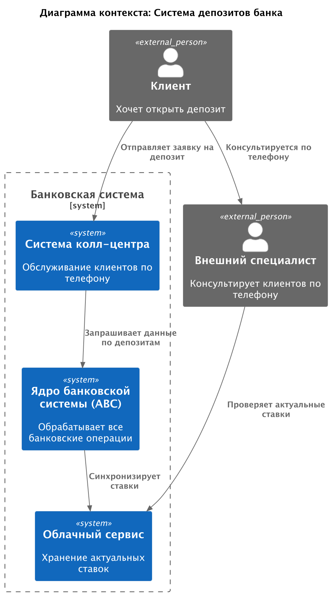
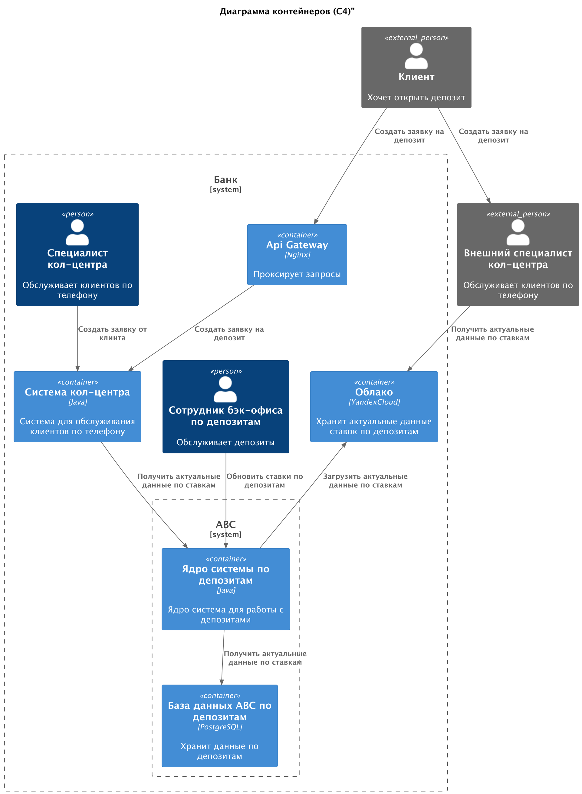
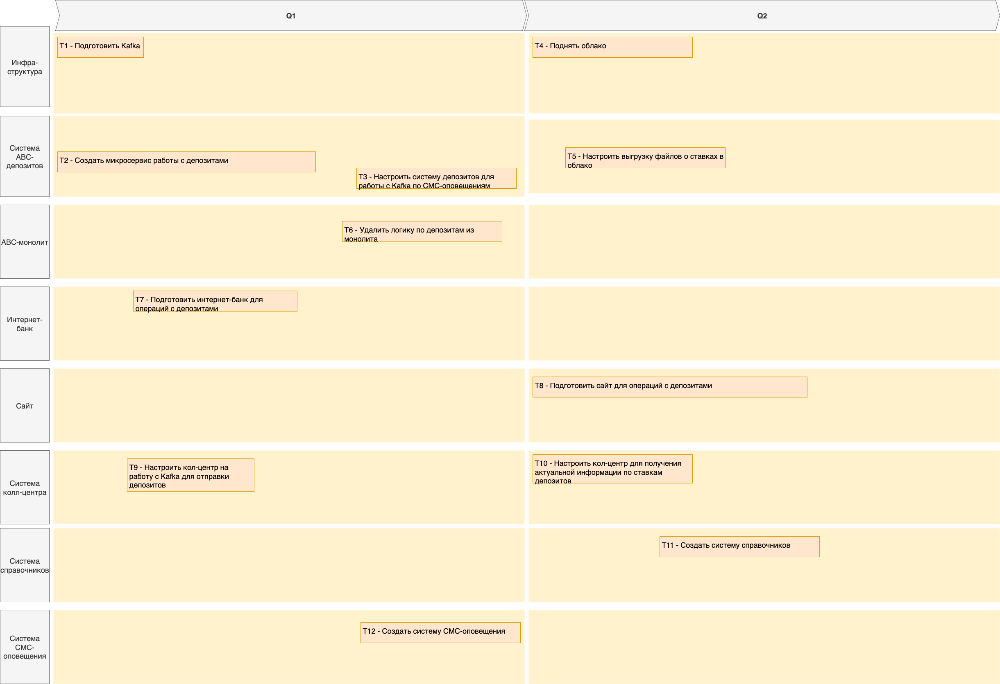

# Задание 4. Передача ставок в кол-центр

# Решение

### **Название задачи:**

Получение данных по депозитам кол-центром

### **Автор:**

Николаева Елизавета

### **Дата:**

27.07.2025

### **Функциональные требования**

| **№** | **Действующие лица или системы**             | **Use Case**                                                                             | **Описание**                                                                                                                     |
|:-----:|:---------------------------------------------|:-----------------------------------------------------------------------------------------|:---------------------------------------------------------------------------------------------------------------------------------|
|   1   | Клиенты, кол-центр, ABC-система депозитов    | Кол-центр должен иметь возможность узнавать актуальные данные по депозитам               | Пожилые клиенты кол-центра захотят узнавать информацию по депозитам через кол-центр                                              |
|   2   | Партнерский кол-центр, ABC-система депозитов | Партнерский кол-центр должен иметь возможность получать данные о текущих ставках файлами | Партнерский кол-центр не имеет возможности стучаться по API, ему необходимо получать данные файлами по текущим ставкам депозитов |

### **Нефункциональные требования**

| **№** | **Требование**                                                                   |
|:-----:|:---------------------------------------------------------------------------------|
|   1   | Все БД должны иметь мастера на запись и два слейва на чтение                     |
|   3   | Отклик по всем операциям клиента должен быть рассчитываться миллисекундами       |
|   4   | Все сервисы должны работать 24/7 и быть доступны в 99,9% случае                  |                                                                                                      |
|   5   | Чувствительная информация должна быть зашифрована надежным алгоритмом шифрования |                                                                                                      |||
|   6   | Необходимо использовать известный команде стек технологий                        |

### **Решение**

Диаграмма контекста С4

Диаграмма контейнеров C4

Ключевые решения:

- Создано API в ABC-сервисе для депозитов. Такое решение позволит оперативно получать информацию собственным
  сотрудникам (кол-центра) по API. Это надежное и простое решение
- После того как сотрудник бэк-офиса по депозитам обновил ставки предполагается, что ABC-система по депозитам
  автоматически выгрузит актуальные данные в виде файла в облако
- Облако будет доступно только по логину и паролю сторонним сервисам (партнерскому кол-центру). Данные логина и пароля
  должны регулярно обновляться

### **Альтернативы**

1) Сотрудники бэк-офиса могут вручную выгружать данные в виде файлика сторонним системам, но это будет крайне неудобно.
   Такое решение может подойт на первое время, если система пока не будет сынтегрирована с облаком

**Недостатки, ограничения, риски**

1) Использование облака повышает риски потери данных - ввиду облака или некомпетентности сторонних служб. Тем не менее,
   данные по ставкам не являются супер-чувствительными, в случае чего их открытие не принесет компании убытков. Тем не
   менее, стоит ограничивать время жизни логина-пароля сторонних сервисов в облако, следить за безопасностью данных
   там с особой тщательностью

# Cписок крупных задач для каждой системы из ADR для будущего планирования

| **№** | **Требование**                                                               | **Система**            | 
|:-----:|:-----------------------------------------------------------------------------|:-----------------------|
|  T1   | Подготовить Kafka                                                            | Инфраструктура         | 
|  T2   | Создать микросервис работы с депо                                            | Система ABC-депозитов  |
|  T3   | Настроить систему депозитов для работы с Kafka по СМС-оповещениям            | Система ABC-депозитов  |
|  T4   | Поднять облако                                                               | Инфраструктура         |
|  T5   | Настроить выгрузку файлов о ставках в облако                                 | Система ABC-депозитов  |
|  T6   | Удалить логику по депозитам из монолита                                      | ABC-монолит            |
|  T7   | Подготовить интернет-банк для операций с депозитами                          | Интернет-банк          |
|  T8   | Подготовить сайт для операций с депозитами                                   | Сайт                   |
|  T9   | Настроить кол-центр на работу с Kafka для отправки депозитов                 | Система колл-центра    |
|  T10  | Настроить кол-центр для получения актуальной информации по ставкам депозитов | Система колл-центра    |
|  T11  | Создать систему справочников                                                 | Система справочников   |
|  T12  | Создать систему СМС-оповещения                                               | Система СМС-оповещения |

# ROADMAP

https://drive.google.com/file/d/1Fjbv2kAlPF0JtnzH_eoENeNPni_ELQlY/view?usp=sharing

